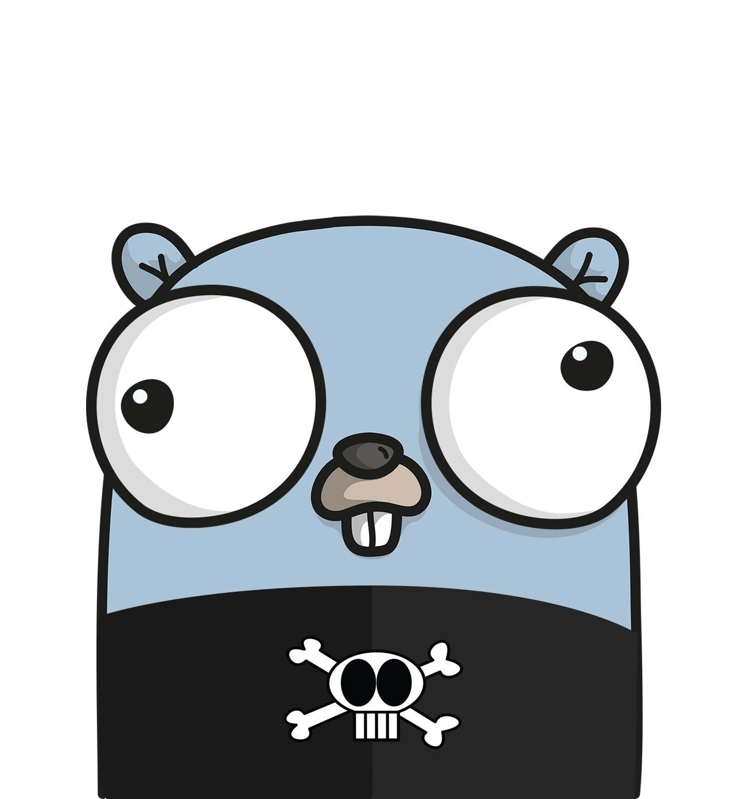
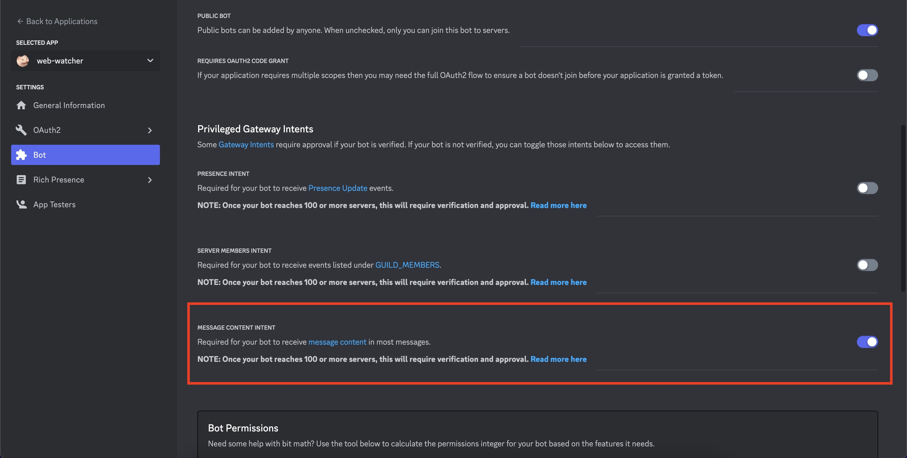

<p align="center">
  
  <h3 align="center">web-watcher</h3>
  <p align="center">A small Discord bot which aims to alert you on website changes.</p>
</p>

<p align="center">
  <a href="https://goreportcard.com/report/github.com/shellbear/web-watcher" alt="Go Report Card">
    
  </a>
  <a href="https://github.com/shellbear/web-watcher/actions?query=workflow%3Alint" alt="Pipeline status">
    
  </a>
  <a href="https://github.com/shellbear/web-watcher/actions?query=workflow%3A%22github+pages%22" alt="Pipeline status">
      
    </a>
  
  <a href="https://opensource.org/licenses/MIT" alt="Go version">
    
  </a>
</p>

---

## Recent Update

Due to Discord API changes, please make sure to enable your Discord Bot `Message Content Intent` permission to work and be able to read Discord commands.



More instructions here: [https://shellbear.github.io/web-watcher/requirements/](https://shellbear.github.io/web-watcher/requirements/)

---

## Documentation

A full documentation is available at [https://shellbear.github.io/web-watcher](https://shellbear.github.io/web-watcher).

## Usage

```bash
> web-watcher --help
Web-watcher discord Bot.

Options:
  -delay int
        Watch delay in minutes (default 60)
  -prefix string
        The discord commands prefix (default "!")
  -ratio float
        Changes detection ratio (default 1)
  -token string
        Discord token
```

By default, the watch interval for every website is 1 hour, but you can easily change this with the `interval` parameter
followed by the interval in minutes.

```bash
export DISCORD_TOKEN=YOUR_DISCORD_TOKEN
# Set watch interval to 10 minutes, defaults to 60 minutes
web-watcher --interval 10

# OR

# Set watch interval to 10 minutes, defaults to 60 minutes
web-watcher --token YOUR_DISCORD_TOKEN --interval 10
```

## Discord commands

#### !watch [URL]

Add a URL to the watchlist.

#### !unwatch [URL]

Remove a URL from the watchlist.

#### !watchlist

Get the complete watchlist.

## Built With

- [go-difflib](https://github.com/pmezard/go-difflib) - Partial port of Python difflib package to Go
- [xxhash](https://github.com/cespare/xxhash) - Go implementation of the 64-bit xxHash algorithm (XXH64)
- [Gorm](https://github.com/jinzhu/gorm) - The fantastic ORM library for Golang
- [DiscordGo](https://github.com/bwmarrin/discordgo) - Go bindings for Discord

## License

This project is licensed under the MIT License - see the [LICENSE](LICENSE) file for details
